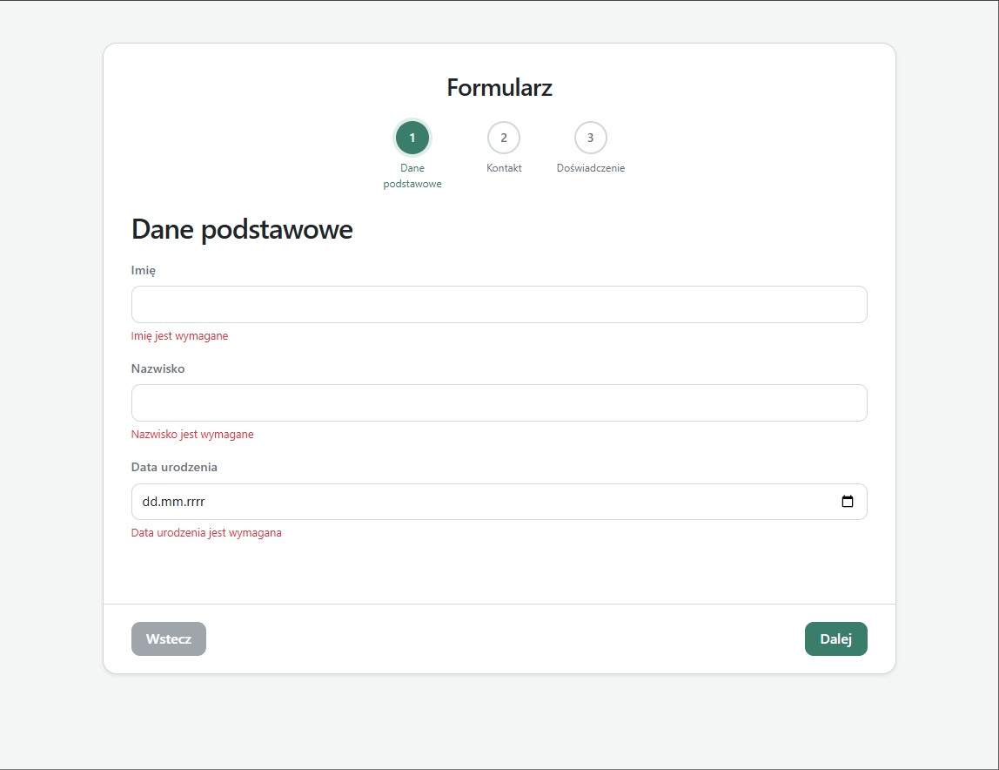
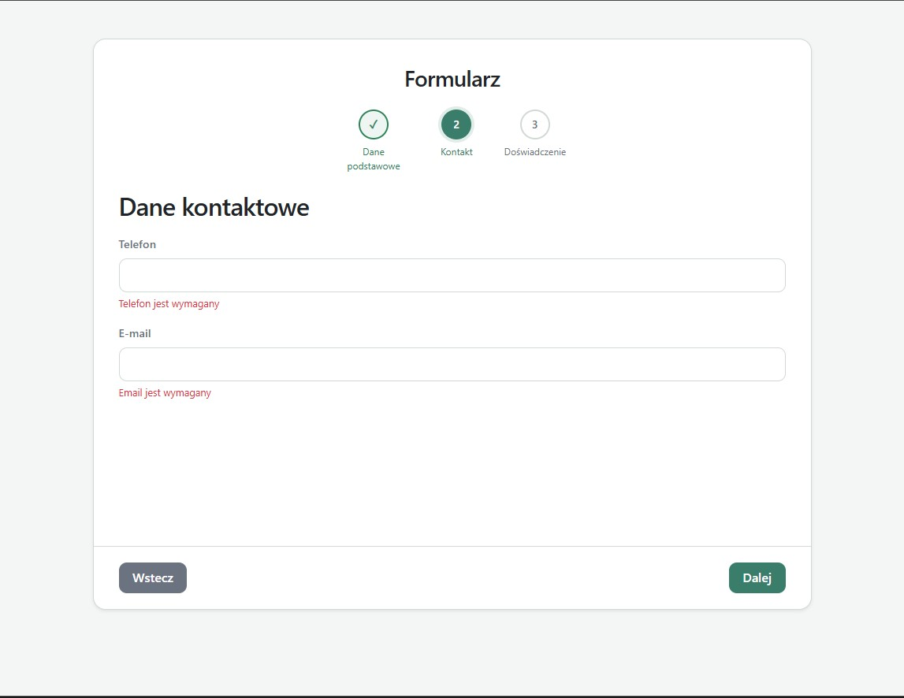
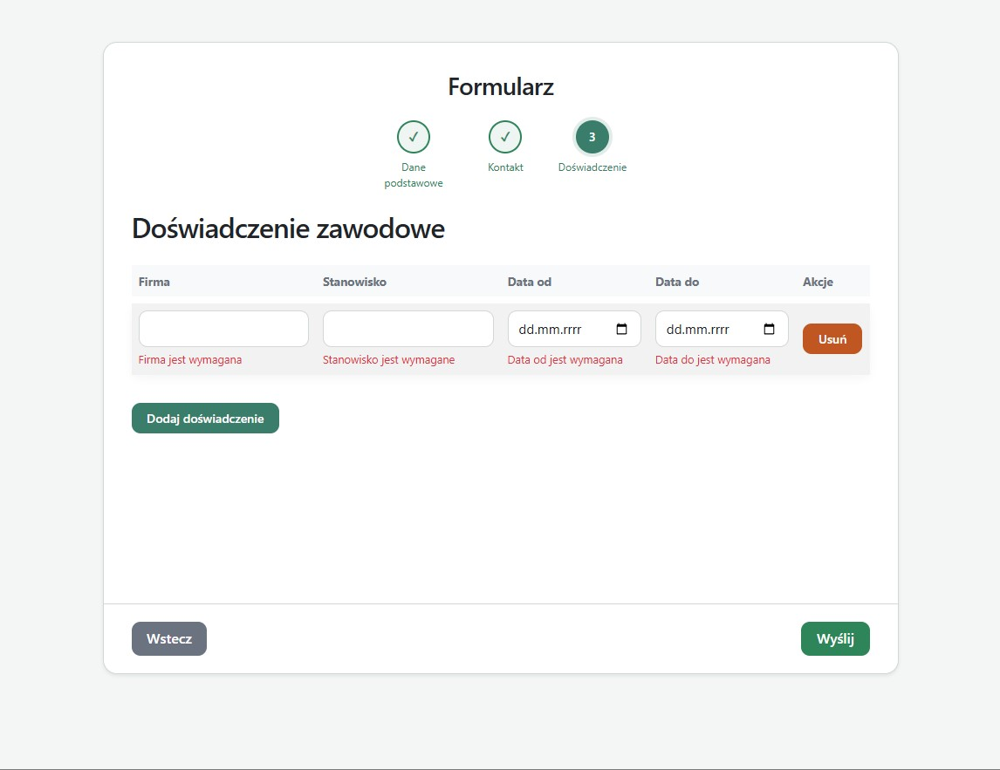
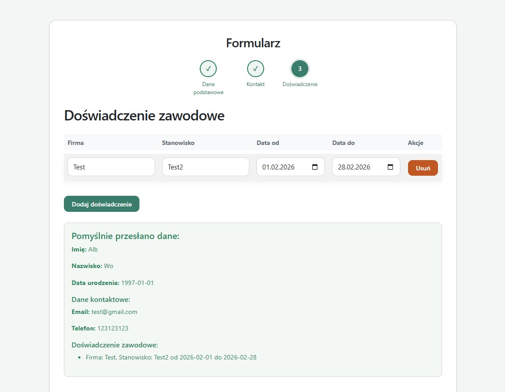

# Multi-Step Form Application

Aplikacja webowa zbudowana w Symfony 6.4 oraz Vue 3 umożliwiająca wprowadzanie danych w formularzu wieloetapowym (3 kroki), walidację po stronie frontendu i backendu oraz zapis danych do bazy danych przy użyciu Doctrine ORM.


## Opis projektu

Celem projektu było stworzenie formularza wieloetapowego (multi-step form) obejmującego trzy główne sekcje:

## Dane podstawowe

* Imię (wymagane),
* nazwisko (wymagane),
* data urodzenia (wymagane, data < dziś)

## Dane kontaktowe

* Telefon (wymagane, walidacja numeru telefonu),
* E-mail (wymagane, walidacja poprawnego adresu e-mail)

## Doświadczenie zawodowe


Tabela z możliwością dodawania wielu wpisów

Pola: 
* firma (wymagane),
* stanowisko (wymagane),
* data od( wymagane, walidacja dat: od ≤ do),
* data do (walidacja dat: od ≤ do)

## Wynik wysłania

Po poprawnym wysłaniu formularza i odpowiedzi z backendu dane są wyświetlane.

# Działanie
Formularz 3-krokowy z możliwością swobodnego przechodzenia między krokami
Dane z formularza są walidowane po stronie Vue 3 (Vuelidate)
Dane są przesyłane do backendu w formacie JSON.
Dane są mapowane na DTO
Walidacja danych.
Zapis danych do encji.

# Uruchomienie projektu
Skopiuj repozytorium i przejdź do katalogu projektu
````
git clone <repo-url>
cd form-app
````
Uruchom kontenery Docker
````
docker-compose up -d --build
````
Zainstaluj zależności i utwórz bazę danych
````
docker-compose exec php composer install
docker-compose exec php php bin/console doctrine:database:create
docker-compose exec php php bin/console doctrine:migrations:migrate
````
Zainstaluj zależności JavaScript
````
docker-compose exec php yarn install 
lub
docker-compose exec php npm install 
````
Zbuduj frontend (Webpack Encore)
```
docker-compose exec php yarn run build
lub
docker-compose exec php npm run build
```
Otwórz przeglądarkę i przejdź do http://localhost:8080, aby zobaczyć działającą aplikację.

# Testy
Minimalny zestaw testów
* tests/Service/FormSubmissionServiceTest.php – testowanie zapisu i walidacji
* tests/Controller/MainControllerTest.php – testowanie endpointu HTTP

## Uruchomienie testów:
```
php bin/phpunit
```